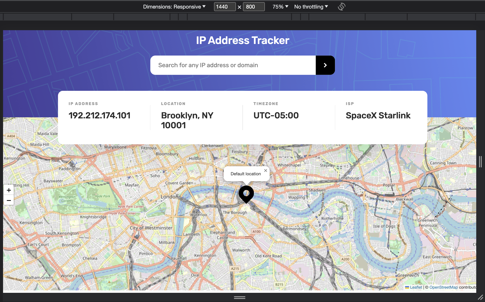
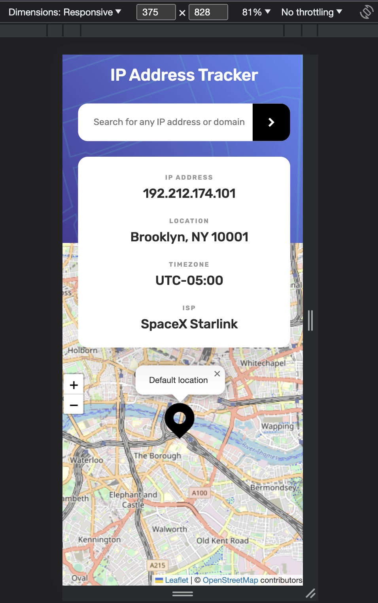

# Frontend Mentor - IP address tracker solution

This is a solution to the [IP address tracker challenge on Frontend Mentor](https://www.frontendmentor.io/challenges/ip-address-tracker-I8-0yYAH0). Frontend Mentor challenges help you improve your coding skills by building realistic projects.

## Table of contents

- [Overview](#overview)
  - [The challenge](#the-challenge)
  - [Screenshot](#screenshot)
  - [Links](#links)
- [My process](#my-process)
  - [Built with](#built-with)
  - [What I learned](#what-i-learned)
- [Author](#author)

## Overview

This project represents a web application which allow users to find the location of the requested ip address or domain name.

### The challenge

Users should be able to:

- View the optimal layout for each page depending on their device's screen size
- See hover states for all interactive elements on the page
- See their own IP address on the map on the initial page load
- Search for any IP addresses or domains and see the key information and location

### Screenshot

Desktop Version

Mobile Version

### Links

- Solution URL: [Solution URL here](https://github.com/AlinaAlexandraVizireanu/ip-address-tracker-master)
- Live Site URL: [Live site URL here](https://alinaalexandravizireanu.github.io/ip-address-tracker-master/)

## My process

I started this project by checking the design on the Figma file, then I created the website's structure with HTML and then used CSS to implement the style.
The logic part of the application was built with JavaScript where I made an HTTP request using AXIOS.
To get the IP Address locations I've used the [IP Geolocation API by IPify](https://geo.ipify.org/) and to generate the map I've used [LeafletJS](https://leafletjs.com/).

### Built with

- Semantic HTML5 markup
- CSS custom properties
- Flexbox
- JavaScript
- Mobile-first workflow
- [IP Geolocation API by IPify](https://geo.ipify.org/) - For IP Address and domain
- [[LeafletJS](https://leafletjs.com/) - For the map

### What I learned

In the process of building the website, I've improved my knowledge regarding HTTP requests and I've learned how to implement the requested data in the webpage.

## Author

- Website - [Vizireanu Alina Alexandra](https://alinaalexandravizireanu.github.io/ip-address-tracker-master/)
- Frontend Mentor - [@AlinaAlexandraVizireanu](https://www.frontendmentor.io/profile/AlinaAlexandraVizireanu)
